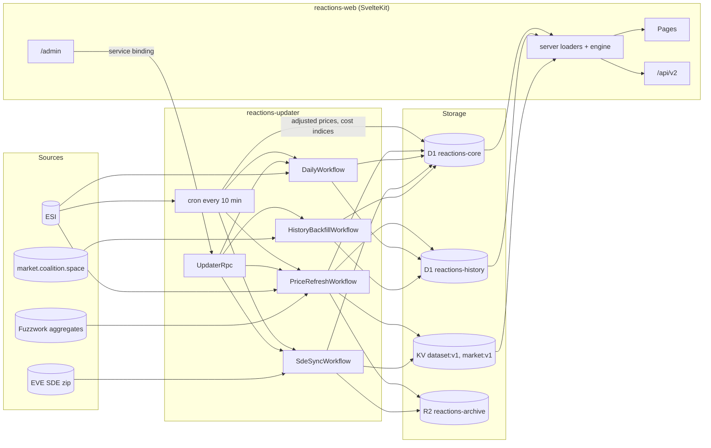

# Architecture

EVE Reactions Calculator v3 runs as two Cloudflare Workers that share two D1 databases, one KV namespace and one R2 bucket:

- `reactions-updater` (`apps/updater`): a cron handler, four Workflows and an RPC entrypoint. It is the only writer of market, history and reference data. Production only (cron triggers and Workflows do not run in Cloudflare Worker Previews).
- `reactions-web` (`apps/web`): the SvelteKit site, API v2 and the admin pages. It reads the shared data, owns accounts and settings, and calls the updater over a service binding. It has two deployments: production on `reactions.coalition.space` and the Worker Preview `preview` on `preview.reactions.coalition.space` (the `previews` block of `apps/web/wrangler.jsonc`: the same D1/KV ids, so the same live data, plus its own vars, secrets and rate-limit namespaces; its service binding calls the production updater).

Calculations live in `packages/engine` (pure TypeScript) and run on the server for every page, and in the browser on `/planner`.

## Data flow

1. The cron (`*/10 * * * *`) refreshes adjusted prices and cost indices directly and starts workflow instances for prices, the SDE and the daily job.
2. Workflows write D1 (latest values in core, time series in history), publish JSON snapshots to KV and archive raw data in R2.
3. Web loaders read KV snapshots (KV `cacheTtl` 60 s plus a 60 s in-memory memo), D1 for per-user data and history, then run the engine with the visitor's settings.
4. `/admin` triggers jobs and republishes the market snapshot through the `UPDATER` service binding (`UpdaterRpc`).

## Cloudflare resources

| Resource      | Name                                            | Web binding            | Updater binding    |
| ------------- | ----------------------------------------------- | ---------------------- | ------------------ |
| D1            | `reactions-core`                                | `DB`                   | `DB`               |
| D1            | `reactions-history`                             | `HISTORY_DB`           | `HISTORY_DB`       |
| KV            | `reactions-cache`                               | `CACHE`                | `CACHE`            |
| R2            | `reactions-archive`                             |                        | `ARCHIVE`          |
| Workflow      | `reactions-price-refresh`                       |                        | `PRICE_REFRESH`    |
| Workflow      | `reactions-daily`                               |                        | `DAILY`            |
| Workflow      | `reactions-sde-sync`                            |                        | `SDE_SYNC`         |
| Workflow      | `reactions-history-backfill`                    |                        | `HISTORY_BACKFILL` |
| Service (RPC) | `reactions-updater`, `UpdaterRpc`               | `UPDATER`              |                    |
| Rate limit    | namespace `3001`, 120 per 60 s (preview `3101`) | `API_RATE_LIMITER`     |                    |
| Rate limit    | namespace `3002`, 10 per 60 s (preview `3102`)  | `ACCOUNT_RATE_LIMITER` |                    |

Both configs live in `apps/web/wrangler.jsonc` and `apps/updater/wrangler.jsonc`; both point their D1 `migrations_dir` at `packages/db/migrations/{core,history}`. Neither serves anything on `*.workers.dev` (`workers_dev: false`, web `preview_urls: false`). The web route is the custom domain `{ "pattern": "reactions.coalition.space", "custom_domain": true, "previews_enabled": true }`: production on `reactions.coalition.space` and Previews on `<name>.reactions.coalition.space` (Cloudflare manages the wildcard DNS record and certificate). The config gate (`scripts/test/wrangler-config.test.ts`, `CUTOVER_DONE`) pins this route; before the cutover it forbade any route, because deploying a custom domain on `reactions.coalition.space` moves the domain off the Worker that holds it (the v2 site). Both have `observability` with logs (including invocation logs), traces and real-time Issues. Web vars: `EVE_SSO_CLIENT_ID`, `EVE_SSO_CALLBACK_URL`, `ADMIN_CHARACTER_IDS`, `USER_AGENT_URL`, `USER_AGENT_CONTACT`, `DEPLOY_ENV` (`production` or `preview`); updater vars: `EVE_SSO_CLIENT_ID`, `USER_AGENT_URL`, `USER_AGENT_CONTACT`. The canonical origin of pages, sitemap and OG URLs is the `SITE_URL` constant in `apps/web/src/lib/site.ts`, not a var, so the preview canonicalises to production.

## Databases

Drizzle schemas: `packages/db/src/schema/core.ts` and `history.ts`. Migrations: `packages/db/migrations/core` (`0000` to `0004`) and `packages/db/migrations/history` (`0000`). Timestamps are unix milliseconds, dates are `YYYY-MM-DD` (UTC).

### Core (`reactions-core`)

| Table                                                    | Contents                                                                                                                                                       |
| -------------------------------------------------------- | -------------------------------------------------------------------------------------------------------------------------------------------------------------- |
| `sde_state`                                              | Imported SDE build, release date, constants                                                                                                                    |
| `types`, `regions`, `systems`                            | Reference data from the SDE (systems carry a `security_band`)                                                                                                  |
| `reactions`, `reaction_materials`, `reprocess_materials` | Reaction formulas and reprocessing outputs                                                                                                                     |
| `market_hubs`                                            | NPC hubs (Jita 4-4, Amarr, Perimeter, Dodixie, Rens, Hek) and structure hubs, with visibility and share status                                                 |
| `latest_prices`                                          | Current buy/sell, 5 % averages, volumes and source (`esi`, `esi_structure`, `fuzzwork`) per hub and type                                                       |
| `adjusted_prices`, `cost_indices`                        | ESI adjusted prices and system cost indices                                                                                                                    |
| `market_stats`                                           | Per region and type: 30-day and 7-day average daily volume, 5-day and 30-day average price                                                                     |
| `users`, `user_sessions`, `characters`                   | Accounts, sessions (hashed tokens), characters with scopes, encrypted refresh tokens and their corporation and alliance (daily cron step)                      |
| `structure_links`                                        | Which account linked which structure through which character, and whether sharing was requested                                                                |
| `job_runs`                                               | One row per job run: kind, status (`running`, `ok`, `partial`, `failed`), detail JSON, and for workflows the step in progress (`progress_json`, `progress_at`) |
| `http_cache`                                             | ETag and expiry of conditional ESI/SDE requests                                                                                                                |

### History (`reactions-history`)

| Table                  | Contents                                                        | Kept                               |
| ---------------------- | --------------------------------------------------------------- | ---------------------------------- |
| `price_snapshots`      | Every price refresh, per hub and type                           | 90 days (after archive and rollup) |
| `price_daily`          | Daily average, close, low and high per hub and type             | Forever                            |
| `esi_market_history`   | ESI regional daily history (average, high, low, volume, orders) | Forever                            |
| `adjusted_price_daily` | Daily copy of adjusted prices                                   | Forever                            |
| `cost_index_daily`     | Daily copy of reaction cost indices                             | Forever                            |
| `archive_manifest`     | Per day: number and size of R2 price archives                   | Forever                            |

## KV keys (`CACHE`)

| Key          | Written by                                                                                    | Contents                                                                                                                    |
| ------------ | --------------------------------------------------------------------------------------------- | --------------------------------------------------------------------------------------------------------------------------- |
| `dataset:v1` | SDE sync                                                                                      | The normalized dataset (reactions, types, constants)                                                                        |
| `market:v1`  | Price refresh, adjusted price and cost index cron steps, `UpdaterRpc.publishMarketSnapshot()` | `MarketSnapshot`: public enabled hubs, `[buy, sell, buyVolume, sellVolume]` per hub and type, adjusted prices, update times |

Private structure hubs never enter KV; the web reads their prices from D1 for the linked users only.

## R2 layout (`reactions-archive`)

| Key                                          | Contents                                                                 |
| -------------------------------------------- | ------------------------------------------------------------------------ |
| `prices/raw/YYYY/MM/DD/<snapshotAt>.json.gz` | All price rows of one refresh (all hubs, private included), gzipped JSON |
| `sde/<build>/dataset.json`                   | Parsed SDE build, read by the later SDE sync steps                       |

Only the updater binds the bucket; it is private and nothing serves it publicly.

## Price and history pipeline

### Cron steps (every 10 minutes)

Each step runs isolated and logs one line `[scheduled] <step>: <outcome>`. Job runs log their start (with cron, manual or retry) and end as `[job] …`, and every workflow step logs its start, duration and result as `[<run id>] step n/total <name>: …` (`StepTracker` in `apps/updater/src/progress.ts`, which also writes the step into `job_runs.progress_json`).

1. `adjusted-prices`: when the cached `/markets/prices` response has expired, a conditional GET; on new data it upserts `adjusted_prices` for tracked types and republishes `market:v1`.
2. `cost-indices`: the same for `/industry/systems` into `cost_indices`.
3. `prices`: settles stale `running` price runs, then starts `reactions-price-refresh` instance `prices-<slot>` when the latest run started at least 30 minutes ago (`PRICE_REFRESH_MINUTES`). A failed run does not hold back the next one.
4. `sde-check`: once per hour (minutes 0 to 9) a conditional GET of the SDE `latest.jsonl`; a newer build starts `reactions-sde-sync` instance `sde-<build>`.
5. `daily`: from 11:20 UTC, once the first SDE import exists, starts `reactions-daily` instance `daily-<today>` once per day (before the first import it logs `skipped (no SDE imported yet)`).
6. `affiliations`: once a day (the tick in 12:20 to 12:29 UTC, after downtime), the corporation and alliance of every character of an account seen in the last 30 days (`AFFILIATION_ACTIVE_DAYS`): public ESI `POST /characters/affiliation` and `POST /universe/names`, up to 100 ids per request (`ESI_BULK_CHUNK`), written to `characters` in one statement. Characters in a chunk ESI refuses keep their previous values; a name ESI does not resolve keeps the stored one while the id is unchanged. A new character has no corporation until the next daily run.

### PriceRefreshWorkflow

- `plan`: enabled NPC hubs grouped by region, plus structure hubs due for a refresh (public ones, and private ones with a linked user seen in the last 30 days).
- `region-<id>`: ESI region orders for every tracked type (6 concurrent requests), aggregated per hub (station by location, Perimeter by system). Types that fail, or that are skipped once the ESI guard trips, are priced from Fuzzwork (`source = fuzzwork`).
- `structure-<hubId>`: tries the linked characters (valid token with the structure scopes) until one can read the market; all failing means public hubs fall back to Fuzzwork and private hubs keep their previous prices. A hub deleted after the `plan` step is skipped.
- `publish`: KV `market:v1`, the R2 archive, and `job_runs` `ok` (or `partial` when any price came from Fuzzwork or is missing).

### DailyWorkflow

- `history-<regionId>`: ESI `/markets/{region}/history` for every tracked non-formula type; only days newer than the stored maximum are inserted (the first run stores the full history ESI returns), then `market_stats` is recomputed.
- `rollup-prices`: yesterday's `price_daily` from `price_snapshots`.
- `rollup-indices`: today's `adjusted_price_daily` and `cost_index_daily`.
- `archive-verify`: counts yesterday's R2 archives into `archive_manifest`.
- `retention`: deletes `price_snapshots` older than 90 days for days that are rolled up and fully archived: `archive_manifest.object_count` must be at least the number of refreshes (distinct `snapshot_at`) of that day, so every refresh has its R2 copy.
- `prune`: deletes expired `user_sessions` rows and finished `job_runs` rows older than 90 days (`JOB_RUN_RETENTION_DAYS`); running rows stay.

### Market history import (HistoryBackfillWorkflow)

Started only from `/admin` (Market history import, **Import now**). For every tracked non-formula type it requests `https://market.coalition.space/api/v1/history-aggregate/{type_id}` from 2025-02-01 to today (all regions in one request, 3 concurrent requests, 25 types per step). Per hub region and type it replaces the stored `esi_market_history` rows inside the returned date range; newer ESI days and regions the mirror lacks are kept. Then `market_stats` is recomputed per region.

### SdeSyncWorkflow

`download-parse` (download, stream-parse, validate at least 100 reactions and all constants, store in R2), `write-reference` (`types`, `regions`, `systems`), `write-reactions` (replaces the reaction tables in one batch), `publish` (KV `dataset:v1`, `sde_state`).

## Settings model

Settings are a zod schema in `packages/engine/src/settings.ts`: global values (mode, cycle days, slot allocation, reprocessing yields) and reactor profiles (structure, rigs, system, taxes, skill, market hubs and methods, shipping). Mode `shared` uses one profile; `per_reactor` keeps one each for biochemical (including Molecular-Forged), composite and hybrid.

Only the difference from `DEFAULT_SETTINGS` is stored, versioned (`v: 1`), as JSON compressed with deflate-raw and encoded base64url. Decoding is size-bounded: settings codes may inflate to at most 64 KiB, planner share codes to at most 512 KiB.

| Where             | Storage                                                                                           | Notes                                                                                                                                                                                                                                                                                                                                                                                                                                                   |
| ----------------- | ------------------------------------------------------------------------------------------------- | ------------------------------------------------------------------------------------------------------------------------------------------------------------------------------------------------------------------------------------------------------------------------------------------------------------------------------------------------------------------------------------------------------------------------------------------------------- |
| Anonymous visitor | `rc_settings` cookie (HttpOnly, 1 year)                                                           | No cookie at all while settings equal the defaults or after a reset                                                                                                                                                                                                                                                                                                                                                                                     |
| v2 visitor        | v2's per-setting cookies (`brokers`, `inMarket`, …, `_composite`/`_biochemical`/`_hybrid` copies) | On a page request without `rc_settings`, `apps/web/src/lib/server/legacy-cookies.ts` converts the values that differ from v2's own defaults into `rc_settings` (v2 wrote its defaults on every visit, so they are not the visitor's choices); invalid values are skipped one by one; `space`, `cycles`, `partner` are dropped. Every v2 cookie is deleted on every page request. An existing `rc_settings` or valid account settings win over v2 values |
| Logged in         | `users.settings_json` (+ `settings_updated_at`)                                                   | Source of truth when logged in; the cookie is rewritten from it at login. A first login stores the current cookie settings in the account                                                                                                                                                                                                                                                                                                               |
| Share link        | `/settings?import=<encoded>`                                                                      | Shows a preview with the differences highlighted; only the explicit Apply (POST) changes settings                                                                                                                                                                                                                                                                                                                                                       |

Other client state: `rc_theme` (dark by default) and the planner state in `localStorage` (with its own share link).

Planner share links (`/planner?s=<code>`) carry the plan plus the sharer's settings as the same sparse diff (`settings` field; links without it, or with invalid settings, use the viewer's settings). `/planner` decodes the code on the server and, when those settings differ from the viewer's (compared after `normalizeSettings`), resolves them like the viewer's own (systems, cost indices, hubs; hubs the viewer cannot access fall back to Jita with `HUB_UNAVAILABLE`), so the viewer sees the sharer's numbers. A notice then offers "Use my settings" (the same plan re-encoded without settings) and "Review these settings" (the `/settings?import=` preview). Opening a share link leaves the stored plan alone until the first edit; a notice warns when that edit would replace a different saved plan.

## Accounts and ESI feature scopes

- Login (`/auth/login`) uses EVE SSO and asks for no scopes. The session token lives in the `rc_session` cookie; D1 stores only its SHA-256 hash. Sessions last 30 days and renew when fewer than 15 days remain.
- An account can hold several characters (`purpose=add_character`).
- Extra permissions are granted per feature (`purpose=feature&feature=<name>`), re-authenticating the character with the feature's scopes added to the ones it already has. `/auth/login` grants only features a page offers (`OFFERED_FEATURES`, currently `structures`). The registry is `ESI_FEATURES` in `packages/eve/src/scopes.ts`:

| Feature      | Scopes                                                                                                   | Offered in the UI |
| ------------ | -------------------------------------------------------------------------------------------------------- | ----------------- |
| `login`      | none                                                                                                     | yes               |
| `structures` | `esi-markets.structure_markets.v1`, `esi-universe.read_structures.v1`, `esi-search.search_structures.v1` | yes               |
| `wallet`     | `esi-wallet.read_character_wallet.v1`                                                                    | no                |
| `assets`     | `esi-assets.read_assets.v1`                                                                              | no                |
| `industry`   | `esi-industry.read_character_jobs.v1`                                                                    | no                |

`ALL_ESI_SCOPES` (all six scopes) is the scope list to enable on the EVE developer applications. Refresh tokens are stored encrypted with AES-GCM (`TOKEN_ENCRYPTION_KEY`, shared by both workers because both refresh and rotate them). Production and the preview log in with different SSO applications (`EVE_SSO_CLIENT_ID`); every deployment also holds the other application (`EVE_SSO_EXTRA_CLIENT_ID`/`EVE_SSO_EXTRA_CLIENT_SECRET`). A feature grant stores the issuing application in `characters.sso_client_id` (core migration 0005; NULL = the deployment's own application), and every refresh (web `getAccessToken`, updater structure step) uses that application's credentials (`ssoCredentialsFor` in `@reactions/eve`); a token from an application the deployment has no credentials for is marked invalid with `SSO_APP_UNKNOWN`, without a request.

Admins are the accounts holding a character listed in `ADMIN_CHARACTER_IDS`; `/admin` answers 404 to everyone else. Admin rights follow the character id, so a transferred character keeps them until the list is changed.

### Analytics identity

Logged-in visitors are identified in Rybbit (`apps/web/src/lib/analytics.ts`, called from the root layout): user id = `users.user_id`, traits built by `analyticsIdentity()` (`apps/web/src/lib/server/analytics.ts`) from the session (the same two queries load `AccountFacts`: account creation time, features granted to any character, the main character's corporation and alliance) and the settings: `username`/`name` (main character = the account's first character), `main_character_id`, `corporation`, `alliance`, `is_admin`, `characters`, `account_created`, `features`, `structure`, `security`, `input_hub`, `output_hub` (`structure` for a structure market, never its id), `per_reactor`, `slots`, `unrefined`, `custom_settings`; per-reactor values that differ are sent as `mixed`. The security band is the only extra lookup (memoised per isolate). The browser sends one identify per login or trait change (`localStorage.rc_analytics_identity`) and clears the id on logout. Custom events: `multibuy_copy` (`items`), `share_link_copy` (`kind`: settings, planner), `planner_autofill` (`scope`), `planner_add_target` (`data-rybbit-event` attributes).

Traits are never `null`: Rybbit drops the whole trait update when any value is `null` while still answering `{"success":true}` (checked on ry.zm.gl, 2026-10-09). A corporation not looked up yet is sent as `unknown` (alliance `unknown` too), a character without an alliance as `none`.

## Structure markets

1. A logged-in user enables "Structure markets" for a character on `/account` (feature re-auth with the structure scopes).
2. On `/account/structures` the user searches structures the character can see (up to 20 results) and adds one (at most 5 per account). Adding probes the market once; a 403 refuses the link. Search and add are limited to 10 per minute per account (`ACCOUNT_RATE_LIMITER`; over the limit the form answers 429 "Too many requests. Wait a minute and try again.").
3. The structure becomes a private hub `structure-<id>` usable only by its linked users. Prices arrive with the next price refresh.
4. The user may switch on sharing; the hub becomes `pending` in the `/admin/hubs` review queue. Approve makes it a public hub (it enters `market:v1`); Reject keeps it private.
5. Removing the last link deletes a private hub with its prices and history; a public hub is disabled with `last_error = NO_CONTRIBUTOR`.

A settings profile that names a hub the visitor cannot access falls back to Jita 4-4 with the warning `HUB_UNAVAILABLE`.

## Engine (`packages/engine`)

- `calculateReaction(reaction, ctx, { view, outputMode })`: one reaction as a single step (buy inputs) or as a full chain (`view: 'chain'`: intermediates built from raw inputs), selling the product or its reprocessed materials (`outputMode: 'reprocessed'`). Results contain inputs, outputs, job costs (EIV, cost index, facility tax, SCC), fees, shipping, profit, margin and profit per slot-day, plus warnings.
- Unrefined routes in chains (`unrefined.ts`, setting `unrefinedInChains: 'never' | 'best'`, default `never`, API v2 query parameter of the same name): a chain intermediate that is also a reprocessed output of an Unrefined reaction (the 17 composite intermediates) can be made by that reaction plus reprocessing. `unrefinedCandidates` screens types whose route is cheaper or faster per unit (byproducts credited at the better of purchase cost and net sale value; at most `MAX_UNREFINED_CANDIDATES` = 6), `chooseUnrefined` evaluates every combination of the candidates on the chain exactly as displayed (single slot: `calculateReaction`; optimal slots: `optimizeChainLines`, line count picked per combination) and keeps the one with strictly higher profit per slot-day; while the chain still loses money it must also lose less per final unit (otherwise a longer chain would only spread the same loss over more slot-days); ties keep fewer substitutions; without a regular profit (missing price) nothing is substituted. Runs = fewest unrefined runs whose reprocessed output (`reprocessOutputs` rounding, unrefined yield) covers the need; the target's leftover is chain surplus. Byproducts replace purchases of their type by later jobs (see the order rules below; a partly covered purchase is split), the rest is sold at the output hub with fees and shipping and counts in profit. Choices are memoised per `CalcContext`. Result shapes: `ChainNode.reprocess` (`ChainReprocess`: replaced reaction, yield, outputs with used/sold, surplus), `StepMaterial` source `byproduct`, `ReactionResult.viaUnrefined`; `CalcOptions`, `LineOptions` and `PlanInput` accept a fixed `viaUnrefined`. The planner uses the union of each target's choice; byproducts replace purchases one cycle later (steady state: previous cycle; build-up: jobs of the cycle before) and the excess is sold; Buy instead of build wins over substitution.
- Views and the setting: `single`, `chain` and `unrefined` are fixed wherever a tab or `view=` picks them: `chain` is always the regular chain and `unrefined` always uses the routes `chooseUnrefined` picks, so lists, reaction pages and API `view=chain|unrefined` can be compared side by side. The "Using unrefined" tab (`?view=unrefined`) exists where `unrefinable(reaction, dataset)` holds (some chain intermediate has an unrefined route; structural, so links do not change with prices); when no route wins it shows the regular chain with a note. `unrefinedInChains` (default `never`) only matters where no view is chosen: `chainFor(row, settings)` (row.unrefined when `best`, else row.chain) ranks the home Full chain board and the listing/API `best`; the planner (`planReactions`, `suggestFillPlan`, API `POST /plan`) builds with the routes. With `best`, the visitor's default tab becomes Using unrefined where it exists (`DefaultTabs.unrefined`, `tabsFor`): tier sections and reaction pages without `?view=` open on it, links to it need no query and links to Full chain spell out `?view=chain`; home items ranked with routes link to it.
- Byproduct order in a single-slot chain (`assignByproducts`): a byproduct only replaces purchases of jobs that start after the producing unrefined job has finished, never its own inputs or its sub-jobs. Uses are assigned most valuable first (units × the buyer's purchase price plus fees; ties in job order), each adding a dependency edge (`waitsFor`); when two unrefined jobs could feed each other only the more valuable direction is taken. `ChainNode.step` = 1 + the highest step of its sub-jobs and of the producers it waits for (`chainDepth` = the root's step); production steps, flow chart columns and "reprocessed in step N" labels use it. Example: in Fermionic Condensates, Unrefined Prometium (step 1) gives Cadmium to Unrefined Dysporite (step 2), whose own Mercury is sold. Optimal slots and the planner reuse the previous cycle's byproducts (own included) in the steady cycle; cycle 1 buys in full. `listReactions` over 119 reactions with optimal slots: about 14 ms with the setting off (the Using unrefined variant is computed too), about 9.5 ms on; single slot about 2 to 2.5 ms.
- `calculateAllocated(...)` with `slotAllocation: 'optimal'` (`allocation.ts`): `optimizeChainLines` tries 1 to `settings.maxParallelLines` final-product lines running in parallel slots (setting Max parallel lines, 1 to `MAX_PARALLEL_LINES` = 10, default 4; API v2 query parameter `maxLines`; the `maxLines` option overrides it, and the memo key uses the effective cap), or a fixed count of 1 to 10 via `lines`, ranks them by profit per slot-day with surplus valued at the output price, and prefers fewer lines within 0.5 % of the best. The result reports slots, utilisation, phases and initial investment.
- Input sourcing (`sourcing.ts`, `InputSourcing`): for buy-order and instant purchases, the total need per type across the whole calculation is bought at the input hub up to its listed volume; the rest is priced at the fallback hub (`inputFallbackHub`, Jita by default), with the warning `INPUT_VOLUME_SHORT`.
- Listing (`listing.ts`): `listReactions` and `rankRows` feed the listing pages, the home boards and the API. `listReactions(ctx, filter, allocation, { unrefined })` computes the Using unrefined variant unless `unrefined: false`; the home boards pass `unrefinedInChains === 'best'`, since they show no such tab and rank with it only when the setting is on (this halves their composite work for default visitors).
- Planner (`planner.ts`): `planReactions` turns slot targets (lines or quantities per cycle) into reactions to run, shopping lists, initial investment and phases; `suggestFillPlan` fills free slots with the best candidates, optionally capped by a share of daily volume. Each `PlanReaction` carries `product` and `materials` (one cycle's consumption per material with `producer`, the plan reaction building it, or null when bought), which the planner's material flow (`layoutPlanFlow` in `apps/web/src/lib/planner/flow.ts`, the shared `layoutFlow` and `FlowDiagram.svelte`) draws per steady cycle: bought materials, reactions by depth, targets last, and a back edge from each unrefined job to the bought material its byproduct replaces next cycle (`reprocess.byproducts[].used`), run in a lane below the diagram. Material boxes show bought and reused amounts.
- Start-up (planner and optimal slots): the planner itemises every one-time cycle until the first steady one (`PlanPhase` `{ cycle, label: 'step_0' | 'build_up' | 'steady', blueprintTypeIds, slots, purchases, jobCost }`; the phases' purchases add up to `initialPurchases`). Two start-ups are priced and the one with the lower initial investment is used (`PlanResult.startup` / `ChainAllocation.startup`: `mode: 'buy' | 'step0'` with both investments; ties go to `buy`): `buy` keeps the normal timing and buys in the first cycle what later cycles get from the previous cycle's reprocessing; `step0` adds a one-time cycle 0 that runs the cheapest subset of first-cycle unrefined jobs whose byproducts another first-cycle job buys, so those are not bought; its main material stays as pipeline stock (`startup.step0.stock`). A job reusing only its own byproduct never triggers a step 0. The steady cycle is the same either way. Initial investment = purchases of all start-up cycles up to and including the first steady one (minus stock, earliest first, priced together) + their job costs + formulas. `PlanReaction.reprocess` (`replaces`, `byproducts` with `used`, `sold`, `usedBy[{ blueprintTypeId, fromCycle }]`) replaces `reprocessedFor`. On the owner's data step 0 never wins (Fermionic Condensates: buy 4.10B over 2 cycles vs step 0 4.53B over 3 at defaults); Ferrogel and Fermionic Condensates are the only chains where it is an option.
- Start-up note (`startupSummary` in `apps/web/src/lib/startup.ts`, rendered by `StartupNote.svelte` on the planner and reaction pages with optimal slots): a heading with the decision ("No step 0" or "Step 0, once before cycle 1"; none when no step 0 was possible) and one bullet per point: what step 0 runs and saves, the two initial investments, stock it leaves; that every unrefined reaction runs each cycle; every byproduct a steady cycle reuses (`startup.reused`, the materials a steady cycle gets from the previous cycle's reprocessing; the start-up buys them until they exist); and why the other start-up was not used (more expensive, or not compared because a start-up purchase is unpriced). Without reuse and without a step 0 option there is no note. The planner's "Unrefined routes" box lists only "regular → replaced by unrefined" (and the step 0 marker); where byproducts go is drawn in the material flow.
- Material order (`fuelFirst` in `packages/engine/src/constants.ts`, fuel blocks = SDE group 1136): every material list puts fuel blocks first and otherwise keeps its order (blueprint order per job, first-seen order in aggregated lists; 4 SDE formulas list another input before their fuel block). It applies to chain job materials, `ReactionResult.inputs`, the planner's reaction materials and every purchase list, and API v2 recipes; production steps order their purchases like `inputs`; both material flows draw fuel blocks at the top of their column (`FlowGraph.top`). Multibuy text (`lineItemsMultibuy`) keeps list order.
- Chain material flow (`layoutChainFlow` in `apps/web/src/lib/components/detail/flow.ts`): in one line (single slot) a reprocessing byproduct is an edge from the unrefined job to the later job using it; with optimal slots (`ChainNode.runsPerSlot` set, the steady cycle where every job uses the previous cycle's byproducts) it is drawn like the planner's: the material node on the left counts it as `reused`, one edge per consumer merges its bought and reused rows, and a back edge runs from the unrefined job to the node (kind `byproduct` when nothing of it is bought).
- Runs per slot (`formatRunsPerSlot`, `formatSlotRuns`, `runsPerSlotTitle` in `apps/web/src/lib/format.ts`): uneven slots are shown as `slots × runs` groups, the most common first (`26 × 61 + 4 × 62`), in the planner, slot allocation, production steps, start-up cycles and the listing Slots tooltip (`SlotsSummary.reactions[].runsPerSlot` is the full array).

## Web app

- Pages: `/`, `/composite`, `/biochemical`, `/hybrid`, `/<reactor>/<slug>` (detail with chain, reprocessing, optimal slots, price timing and history charts), `/planner`, `/settings`, `/account`, `/account/structures`, `/admin`, `/admin/hubs`, `/about`, `/api` (Scalar reference). A root error page (`+error.svelte`) handles 404 and other errors with links back to the listings. External links open in a new tab with `rel="noopener"` (no `noreferrer`, so the destination sees the referring origin under `Referrer-Policy: strict-origin-when-cross-origin`).
- Home (`/`, selection in `apps/web/src/lib/server/home.ts`): "Best to build" has one board per reactor with final products only (composite: tier `composite`; biochemical: `booster_*` and `molecular_forged`; hybrid: `polymer`), ranked by mean profit per slot-day over the latest 7 days with data before the snapshot's UTC day (`HOME_DAYS`; 8 days are read so a late rollup still leaves 7). Each day is one listing priced with that day's `price_daily` averages at the visitor's profile hubs (`getDailyHubPrices`), using the region's ESI average where a hub has no row (the window is then marked approximate), with the current cost indices and adjusted prices; a listing at averaged prices equals the mean of the daily profits. Listed when the average is above 0, the product was profitable on at least half of the days, and the output region absorbs at least one slot (`HOME_MAX_SHARE_PCT` 10 % of the lower of the 30-day and 7-day average daily volume, divided by one slot's daily output; regions without statistics are not filtered); up to 10 per board. "Input prices" compares the 5-day and 30-day average prices (`market_stats`) of the raw materials of these products' full chains in the input hub's region; moves under 1 % are ignored; 10 rising and 10 falling.
- Old v2 URLs answer 301 to the new pages: `/<reactor>/<legacyType>/<productTypeId>` (including the v2 biochemical pages `/biochemical/simple/<id>` and `/biochemical/chain/<id>`), `/hybrid/<productTypeId>` and numeric slugs. While the dataset is not loaded, `/<reactor>/<legacyType>/<id>` answers a temporary 307 to the reactor listing instead. `/api/v1/*` answers 410.
- API v2 (`/api/v2`): `meta`, `hubs`, `systems`, `systems/{id}`, `reactions`, `reactions/{slug}`, `profits`, `profits/{slug}`, `prices`, `prices/history`, `cost-indices`, `POST plan`, `openapi.json`. Tabular endpoints support `format=csv`. Requests are rate-limited per IP (120 per minute) through `API_RATE_LIMITER`. The `POST plan` body is read as a stream and refused above 64 KiB (413).
- Request hardening (`hooks.server.ts`): page form posts over 64 KiB answer 413 and posts without `Content-Length` answer 411; every response carries `X-Content-Type-Options`, `Referrer-Policy`, `Content-Security-Policy: frame-ancestors 'none'` and `Strict-Transport-Security` (one year, subdomains); with `DEPLOY_ENV=preview` also `X-Robots-Tag: noindex, nofollow`. Requests under `/api/` never read the session or settings cookies and never write cookies.
- Historical views (`?date=`, price timing, charts) read `price_daily` and `price_snapshots`; days without hub data fall back to the region's ESI average and are marked approximate.
